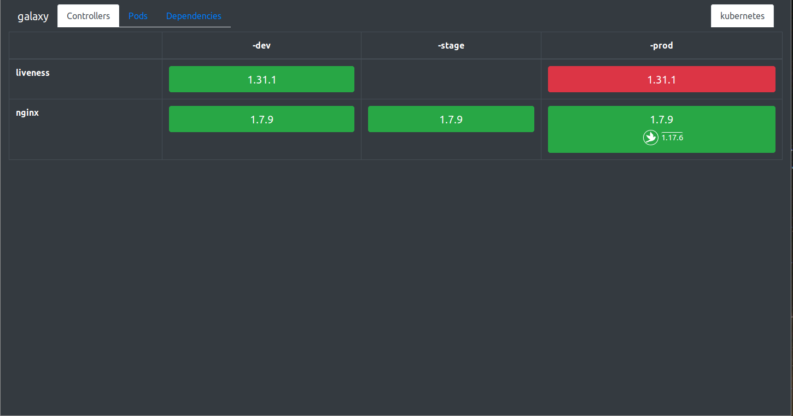

# Andromeda kubernetes dashboard

**Current Status:**

- Backend APIs: Currently fetches version, liveness & readiness of deployments, statefulSets and pods. Dependencies, feature flags are 
available via Prometheus metrics.
- Frontend Dashboard: work in progress




# Getting started:

Andromeda can be quickly deployed to minikube with `skaffold run`

_You will require kubectl, kustomize, minikube, docker and skaffold_
For ingresses to work you will need to add the minikube IP (`minikube ip`) and `igiari.local` to your /etc/hosts file.

# Pretext
Andromeda is designed with the idea of deploying a collector into each cluster with a mounted service account bound with a cluster role similar to the default 
`view` cluster role. Each collector should be configured with the environments (namespace suffixes) required for that cluster in the cluster specific config.
All collectors will use the same global config specifying the applications and the namespace prefixes to be scraped.

The aggregator should be deployed in only one cluster along with the web frontend. The aggregator should be configured
to scrape all collectors via accessible ingresses or other multi-cluster networking.
# Configuration
Andromeda's configuration and scraping of Kubernetes clusters is based on selectors and namespaces. 

## Collector
Using a configured namespace prefix for an application and a selector, each collector will search for namespaces matching the configured
global namespace prefix for an app + cluster specific namespace suffix for each environment.

e.g Configuration as follows:
```yaml
# Global config
global:
  teams:
    - name: teamName
      applications:
        - name: web-frontend
          prefix: webapp
          selector:
            type: frontend
        - name: backend-application
          prefix: backend
          selector:
            type: backend
          statefulSet: backend-app
```
```yaml
# Cluster specific
cluster:
  namespaceSuffixes:
    - -ft
    - -testing
    - -release
  priority:
    last:
      - -release
```

For the web-frontend, the collector will look at namespaces in turn:
- `webapp-ft`
- `webapp-testing`
- `webapp-release`

Then it will look for both deployments (by default) and pods with the specified selector. 
In this case: `type = frontend`. 

The first container in the deployment's image is used to find the version and
the deployment's replica availability is used to find the health.

A different container and the pod controller type can be specifically configured via the 
`<controller name>: <container name>` configuration. 

e.g the `statefulSet: backend-app-container` above would look for stateful sets rather than deployments and would 
read the version of specifically the `backend-app` named container.

### Canary

Canary configuration is in the global (collector) configuration.
e.g
```yaml
global:
  canary:
    enabled: true
#   Labels used to determine if a pod is marked as a canary
#   These labels are also explicitly not selected for normal deployments if canaries are enabled.
    selector:
      variant: canary
```
If enabled, canary deployments will be searched for alongside the normal deployments. These are expected to contain a 
combination of the application's selector and the specified canary selector.

e.g Given an app with a configured selector of `app: backend` and a canary configuration as above with the *canary* selector being
`variant: canary`. The collector will mark anything with labels `app=backend, variant=canary` as a canary and anything with
only `app=backend` _without_ the `variant=canary` as a normal deployment.

This selection logic is based on the [canary deployment pattern](https://kubernetes.io/docs/concepts/cluster-administration/manage-deployment/#canary-deployments)

## Aggregator
The aggregator requires configuring _cluster groups_ which each have a list of collector URIs. The cluster groups
are logically grouped clusters e.g by region. 

_Note: The collector URIs should not include the `/team` path segment but point to the application root of the collector._

Each cluster group is intended to be shown on one dashboard page.
```yaml
aggregator:
  clusters:
    cluster-one:
      type: kubernetes
      collectors:
       - http://my.other.cluster.com
       - http://another.cluster/collector
    cluster-two:
      type: kubernetes
      collectors:
       - http://third.cluster.com
  teams:
    - awesome-team
  prometheusURI: http://localhost:9091/api/v1/
```

The `teams` can be configured for front end indexing. The `prometheusURI` is required for fetching dependency and feature flag information.
 
### Feature flags and Dependencies

Currently this information is gleamed from prometheus metrics: `feature_flag` and `downstream_dependency`, with the aggregator
expecting `pod_name` and `namespace` labels matching the pod they're coming from. (This comes for free with Prometheus 
service discovery and just needs to be relabeled.). 

The `prometheusURI` in the aggregator configuration should point to the prometheus API and to a prometheus that federates
all application downstream_dependency and feature_flag metrics.

Only dependencies are visible on the front end at this time.